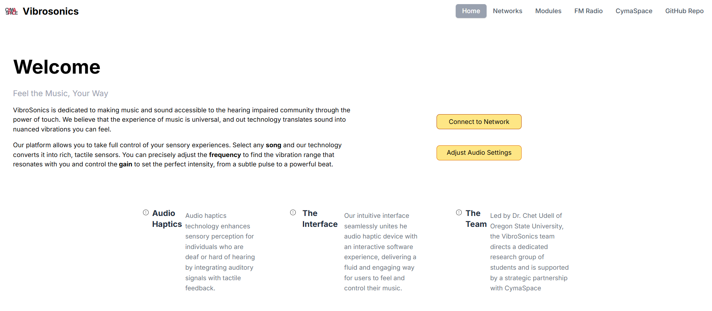
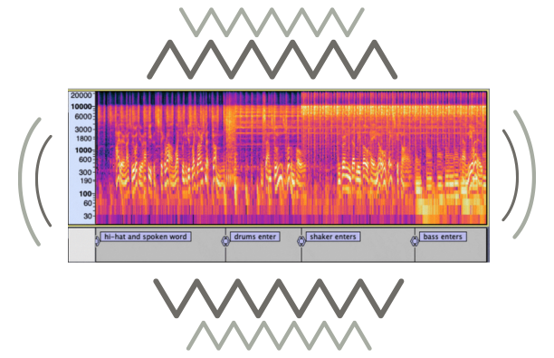
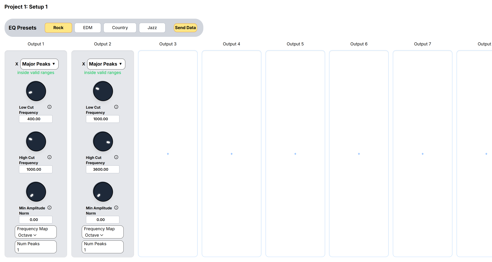

# Vibrosonics

## Experience audio through vibration

**Vibrosonics** is a real-time audio-to-haptics system with an interactive web interface that allows deaf, hard-of-hearing, and sensory-focused users feel sound through vibrarions.

[**Documentation (Doxygen)**](https://udellc.github.io/Vibrosonics/) \
**Hardware:** Adafruit ESP32 Feather, MAX9744 Amplifier board, TT25-8 puck
transducer, 3.5mm audio jack cable \
**Dependencies:** [AudioLab](https://github.com/synytsim/AudioLab)
· [AudioPrism](https://github.com/udellc/AudioPrism)
· [Fast4ier](https://github.com/jmerc77/Fast4ier)

## Table of Contents

- [Why Vibrosonics Matters](#why-vibrosonics-matters)
- [Key Features](#key-features)
- [Try It Yourself](#try-it-yourself)
- [Contributors](#contributors)

## Why Vibrosoncis Matters
Millions of people experience barriers when it comes to audio-based media such as music, games, alerts, or live events. Vibrosoncis transforms those experiences by converting sound into meaningful tactile feedback.

Instead of hearing a beat, you **feel it**.

Built in collaboration with **[Cymaspace](https://www.cymaspace.org/)**, an organization whose goal is to make culture and arts accessible for the deaf and hard-of-hearing community, Vibrosonics is designed to make music, entertainment, and environments more inclusive while also opening up new immersive experiences for everyone. This group makes up our primary audience, as haptic feedback can be used to replace or enhance audio. Some secondary users would be employers whose work environments make pure audio based communication difficult. They could instead receive important audio cues through haptics.

## Key Features
**Real-Time Audio Conversion**
Transforms live audio input directly into haptic vibration with minimal latency.

**Configurable Settings Through Web Application**
A browser-based app allows users to adjust haptic feedback in real-time with no recompiling or device flashing required.

**Frequency-Aware Feedback**
Different pitches and intensities map to distinct vibration patterns, preserving musical structure and adding depth.

**Accessible by Design**
Built specifically for deaf and hard-of-hearing users, while also enhancing experiences for others.

## Try it Yourself
_[View the most stable version on GitHub](https://github.com/udellc/Vibrosonics/tree/main)_
**Basic Setup**
1. Clone the repository
2. Install dependencies:
    - [AudioLab](https://github.com/synytsim/AudioLab)
    - [AudioPrism](https://github.com/udellc/AudioPrism)
    - [Fast4ier](https://github.com/jmerc77/Fast4ier)
3. Upload to ESP32 using Arduino IDE
4. Connect audio input and transducer

For more detailed information about setting up a development environment,
library architecture, and example programs, refer to the following documents:

- [Developer Setup](https://udellc.github.io/Vibrosonics/md_docs_2_s_e_t_u_p.html)
- [Developer Notes](https://udellc.github.io/Vibrosonics/md_docs_2_d_e_v_n_o_t_e_s.html)
- [Contributing Guidelines](https://udellc.github.io/Vibrosonics/md__c_o_n_t_r_i_b_u_t_i_n_g.html)

## Contributors

### 2025-26 Software Team

- [Ivan Wong](https://github.com/IvanW5X)
- [Danielle Chang](https://github.com/danichang1)
- [Bella Mann](https://github.com/mannbella)
- [Ally Aoki](https://github.com/aokiam)

### 2024-25 Software Team

- [Walt Bringenberg](https://github.com/wwaltb)
- [Ben Kahl](https://github.com/ben-kahl)
- [Keith Reinhardt](https://github.com/reinhake)
- [Ashton Tilton](https://github.com/amputee20000)
- [Julia Yang](https://github.com/jjuliayang)

[LinkedIn Pages](https://dot.cards/vibrosonicscs)

### Special Thanks

- Dr. Chet Udell (Project leader and manager)
- Nick Synytsia (Developed AudioLab and advised software development for 2024-25)
- Alex Synytsia (Participated in hardware development during 2022-23)
- Vincent Vaughn (Advised software and hardware development)
- Hans Bestel (Advised software and hardware development)
